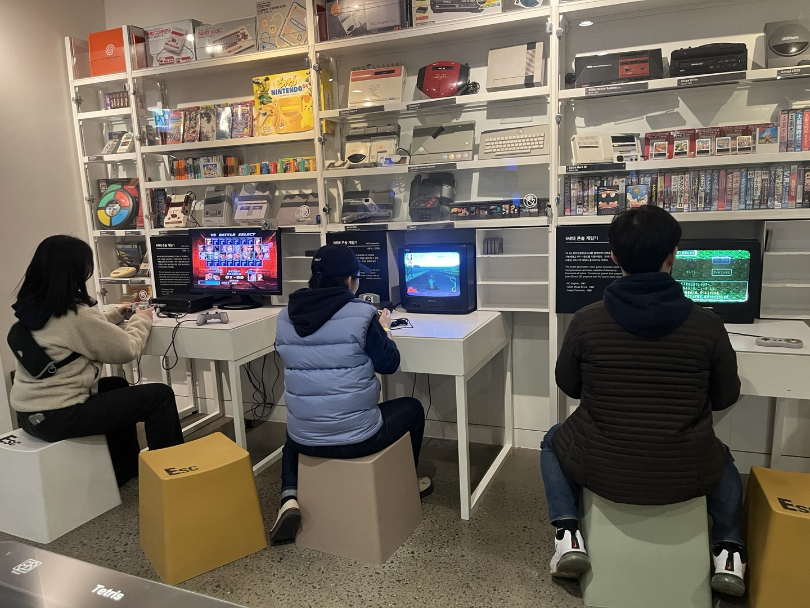
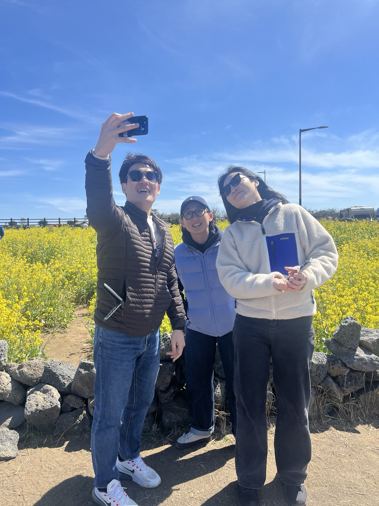

## 첫 동료 &#x270B;&#x1F3FB;

2024년이 시작될때쯤 많은 변화들이 있었다. 그 중 나를 제일 처음 맞이했던 변화는 내 옆에 앉아계시던 동료 (동료라기 보다 선배의 가까운 분)의 퇴사였다. 회사에서 가장 많은 이야기를 나누고 가장 오랜시간 옆자리에서 작업을 했는데 갑자기 떠나시게 되어 굉장히 놀랐다. 
그 분은 혼자 끙끙대며 작업하는 23살짜리 신입이 안쓰러우셨는지 옆에서 많은 질문을 받아주시고 내가 이해를 못하는 것 같으면 회의실로 이동해 칠판에 그림을 그리면서 설명해주셨다.
맡은 일이 많으셔서 한편으론 시간이 아까우셨을수도 있는데 기꺼이 내어주셔서 감사했다. 나도 나중에 누군가에게 질문을 받게 되는 연차가 된다면 친절하고 쉽게 잘 설명해주는 선배가 되어야지 생각했다.

## 첫 이사 &#x1F3D7;&#xFE0F;

회사 인원수의 변화로 인해 회사가 종로에서 당산으로 이사를 했다. 전에 비해 환승을 해야한다는 번거로움이 생겼지만 출근시간이 50분에서 30분으로 줄어들어 기뻤다. (전에는 몰랐는데 출퇴근시간이 업무와 나의 컨디션에 굉장한 영향을 미친다는 것을 깨달았다.) 
당산은 종로보다 맛집도 많고 분좋카(MZ용어/분위기 좋은 카페)도 많아서 회사 오며가며 흥미로운 출퇴근 길이다. 이사하고 함께 회사를 꾸미고 청소하는 날이 있었는데 이때 내가 이 회사에 필요한 존재가 된 것 같은 느낌이 들었다. 
**여러가지 변화중에 얼음정수기가 생겼다는 것과 화장실이 회사 내부에 위치해있다는 것이 특히 좋았다.**

## 첫 워크샵 &#x1F3DD;&#xFE0F;

회사에서 첫번째로 간 워크샵은 제주도였다. 워크샵이라는 것을 처음 가보는 나는 강릉여행 정도로 생각했다. 그러다 제주도라는 이야기를 들었을때는 너무 좋아서 폴짝폴짝 뛰고싶었다.(진짜) 
허시는 혼자 직원인 내가 부담스러워할 것이 걱정되셨는지 따로 업무할 공간을 잡아준다고도 하셨지만 그때에 난 워크샵 가는것도 너무 신났고 제주도로 가는 것도 신났다. 그렇게 신경써주신다니 감사했다. 
그리고 회사 굿즈인 후드티를 맞춰입고 제주도로 떠났다. 정말 재밌게 놀았다. 너무 신나서 진짜 꼬리 뛰어나올뻔했다.(진짜) 
특히 기억에 남는 건 숙소에서 술을 다 마시고 테이블을 정리할 때, 태더가 소원이 있다고 자신있게 말씀하시면서 양말 다같이 벗으면 안되냐고 하셨다. 웃겼다...ㅋㅋㅋㅋㅋㅋㅋㅋㅋㅋ

태: 여러분, 저 소원이 있어여!! 
허, 숑, 조: 네! 몬데용? 
태: 다같이 양말 벗어여!! 
조: 넵 알겠습니다!(바로 벗음) 
허: ㅋㅋㅋㅋㅋㅋㅋㅋㅋㅋㅋㅋㅋㅋㅋ 

워크샵 다녀와서 엄마한테 자랑도 하고 오빠(남자친구)한테 자랑도 했더니 다들 우리 회사 모집공고 언제 열리는지 맨날 물어본다. 
**정말 좋았던 것은 워크샵 다녀온 바로 다음 출근 날이었다. 그 날은 우리끼리 워크샵에서 찍은 사진 정리와 타공판을 꾸몄다.  이런 회사가 또 어딨을까? 내가 원하는 것들을 말씀드리지 않아도 우리 모두가 다 느끼고 있음에, 우리의 온도가 같음에 행복했다.**

## LAHions, 형사가 되다. &#x1F9D0;

몇달을 캘박(MZ용어/캘린더 박제)한 채로 기다려오던 **디텍티브(보드게임) 데이!** 드디어 그날이다. 
허시가 다같이 하면 아주 재밌을거라던 추리테마의 보드게임이다. 이 날을 위해 우리 모두 각자의 컨셉을 정하고 옷과 소품을 신경썼다.<U>(서로 견제하며)</U> 
나는 형사, 태더는 코난, 숑숑은 CSI, 허시는 경찰이었다. 나는 너무너무 신나서 이날 세분을 위해 (몰래) 경찰 공무원증을 기념으로 만들어갔다. 혼자 킥킥대면서. 
태더는 시간이 지날수록 얼굴빛이 보라색(허시 말에 의하면)이 되어가셨지만 난 엄청 신났다.
이때의 기억으로 행크가 힘들때마다 버티고 있다. ㅜㅜ

## 첫 기획회의 참여 &#x2600;&#xFE0F;

사실 전부터 개발얘기보다 기획얘기가 더 재밌었다. 그래서 내가 생각하고 있는 기획방향들을 작은거라도 하나씩 재채기하듯 이야기를 꺼냈었다. 나도 기획회의에 끼워달라는 것이 티가 났는지 어느 순간부터 나도 함께 하도록 해주셨다.  
**비디어스 리뉴얼 하는 과정에서 여러가지 아이디어를 내고 홍보정책을 논의하는 것이 뿌듯했고 내 아이디어를 기뻐 받아주시는 세 분께 감사했다.**(별거 아닌데ㅜㅜ)

## N번째 고난 &#x1F4A6;

**행크다.** 
첫 고난이 아닌 N번째 고난인 이유는 첫번째 고난은 입사하고 첫 스프린트였기 때문이다. 첫 스프린트를 하자마자 느낀것이 '난 개발이랑 안맞다' 였다. 그런데 그것도 잠시 '개발 재밌다! 개발자란 직업이 없었으면 어쩔뻔했어~' 이런 생각이 또 든다.
두가지의 감정이 오락가락하며 1년 반쯤 지났을때 행크를 본격적으로 시작했다.

처음에는 여느 스프린트와 다를것이 없다고 생각되었을쯤 내 생각이 틀렸다고 말해주는 강력하고 복잡한 요구사항들과 수많은 귀찮은 요구사항들이 닥쳐왔다. 행크는 예상한것보다 너무x3 힘들었다. 
내가 말솜씨가 없어서 너무x3으로 표현했지만 행크를 시작한 그때부터 지금까지 안힘들었던 적이 없다. 행크가 미운것도, 개발이 싫은것도 아니었다. 
내가 정말 힘든건 외로워서였다. 웹 프론트를 혼자 맡아서 해야한다는 부담감이 점점 외로움으로 바뀌었던것 같다. 
'다들 이렇게 회사생활 하는거 아닐까.', '직장인이란 원래 이런거 아닐까.' 라는 생각이 들다가도 내 회사는 다른 회사랑은 다르다는 것을 알기에 더 고민이 되었다.
중간중간 연차를 쓰고 휴가를 가며 잠시나마 나만의 도피처를 만들었지만 소용없음을 느꼈다. 완벽히 끝내놓지 않고 즐기는 퇴근과 휴가는 지옥이었다. 그래도 내가 힘든 탓을 행크로 돌리면 그나마 일에 집중하기는 쉽다.  마음속에 계속 외우고 산다. 부천시 길주로 137....

## 썩은계란X방귀냄새 &#x1F9A8;

이 이야기를 N번째 고난 챕터에 포함시켜야 되나 잠깐 망설였다. 
몇 주 동안을 혼자 꾹꾹 참으며 맡던 냄새를 우리 모두가 범인이 아니었음을 알았던 날에는 정말 웃겨 죽을뻔했다. &#x1F923; 
범인은 내가 아닌 내 머리 위에 있던 에어컨 냄새였는데, 지금 생각해보면 세분은 범인을 나라고 생각하고 계셨던 것 같다.
허시와 숑숑 그리고 나의 범인을 찾기까지의 과정은 이렇다. 회사 바닥을 기어다니며 썩어가는 무언가 찾기, 화장실 탕비실 서버실 문열어 제끼며 냄새 맡기, 건물의 윗층들을 방문해 냄새 맡고 있는지 물어보기 등등이었다. 그러던 어느날, 허시가 "계란방귀냄새" 등을 검색하던 중 에어컨이 원인임을 밝혀지고 두두와 쿠로 입사전에 완벽히 해결했다.

## WELCOME 두두, 쿠로 &#x1FAC2;

옥션 모바일을 논의하던 중 두두와 쿠로의 이야기를 듣게 되었다. 쿠로는 내 동기들과 친해서 학교 오며가며 얼굴을 많이 봤었다. 두두와는 이번에 회사에서 처음 알게 되었는데 두 분 모두 내 또래라 친해질 수 있을것 같아 좋았다.(처음엔 낯을 가렸지만) 
앱을 맡아주시는 두두와 쿠로 덕분에 나는 부담감이 덜게 되어서 항상 감사함을 느끼고 있다.

## WELCOME 2025 조이 &#x1F44B;&#x1F3FB;

2024년의 조이는 정말 힘들었다. 이렇게 바쁜 회사생활이 처음이었고 실수도 많이하고 혼도 많이 나고 스스로도 많이 다그쳤다. 마감이 다가올때마다 압박이 심했고(꿈에서도 일한다) 마감을 당일날에도 못맞추는 상황에는 정말 괴롭고 스스로한테 실망도 많이 했다. 

나는 올 한해를 겪으면서 다른것보다 **나**에 대해 배웠다. 나의 '인간적으로' 약한 부분을 마주 볼 수 있었고 내가 컨트롤 할 수 있는 방법을 생각했다. 

**첫째, 환경과 상황을 탓하지 않기.  
둘째, 감정에 동요되지 않기.  
셋째, 맡은 일에 최선을 다하기.  **

이렇게 3가지를 실천해보려고 한다. 세가지를 안해본 것은 아니다. 그런데 3가지를 동시에 이뤄지진 않은 것 같다.  
새로 시작하는 해에는 새로운 마음에 새 뜻을 새겨 '인간적으로' 지금보다 조금 더 성장한 **내**가 되었으면 좋겠다. 화이팅!
